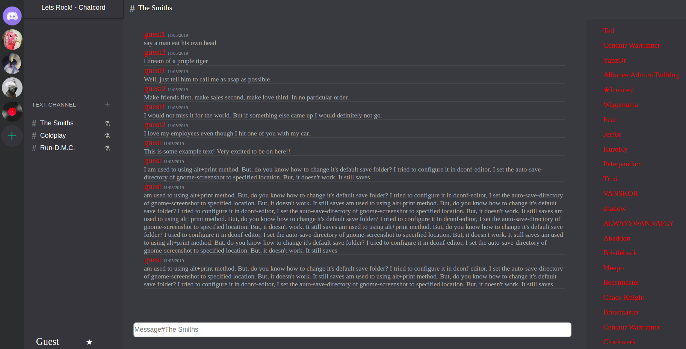

# README

Welcome to ChatCord!  Chatcord is an application that allows users to create their own servers and channels to use as public forums.  Users can join or create servers, or invite other users to servers using unique server keys links.  Admin of servers can create and manage the channels on their server.  Server Members can post messages in these channels.  

## Link to Live Application:
    https://chat-cord.herokuapp.com/#/login

## The project's wiki contains outlines for:
  - Database Schema
  - Backend Routes
  - Frontend Routes
  - Sample State

## Installation and usage
Ruby version: `ruby '2.6.3'`

Run: `bundle install` to install necessary gems.

## A few challenging problems I faced with the solutions I used to solve them:

-  A problem arose when I began working on a larger screen than my laptop and was putting on the finishing CSS touches to the app.  The containers were not variable enough for small to large screens and vice versa.  My solution was to take advantage of the React local state and lifecycle changes to recognized a need to resize the variable containers.

  In CommentsIndexContainer, CommentsHeader, and CommentsForm my constructor was as follows:

        this.state = {
          smallScreen: false,
        };

 I then used the lifecycle method, componentDidMount, to detect a screen change:

        componentDidMount() {
          if (window.innerWidth < 1950) {
            this.setState({ smallScreen: !this.state.smallScreen });
          };
        }

Within my render method, a variable dependent boolean to set the container's className:

        const screenSize = (this.state.smallScreen) ? 'mainSmall' : 'main';

Then I set up two CSS classes with different height and width sizes to compensate for large and smaller screens.

        .main {
          height: 96.4%;
          width: 91%;
        }
        .mainSmall {
          height: 92%;
          width: 80.85%
        }

-  Because some of my child components required props from parents chained a few components up, refreshing the page caused some components to not to load because of variable information not passed through the routes.  My solution was to come up with a Refresh Route that would consider if the correct properties where in the state each time a page was refreshed.

        refresh_route.jsx

        const Refresh = ({ component: Component, path, serversAvailable, exact }) => (
          <Route path={path} exact={exact} render={(props) => (
             !serversAvailable ? (
              <Component {...props} />
            ) : (
              <Redirect to="/servers" />
            )
          )} />
        );

Then I checked if servers were available in the state:

        const mapStateToProps = state => {
          return {serversAvailable: Boolean(Object.values(state.entities.servers).length === 0)};
        };

        export const RefreshedRoute = withRouter(connect(mapStateToProps, null)(Refresh));

Now I can export RefreshRoute for use in any route that might need to catch any potential container from crashing by redirecting to a container does not require pass down props.
